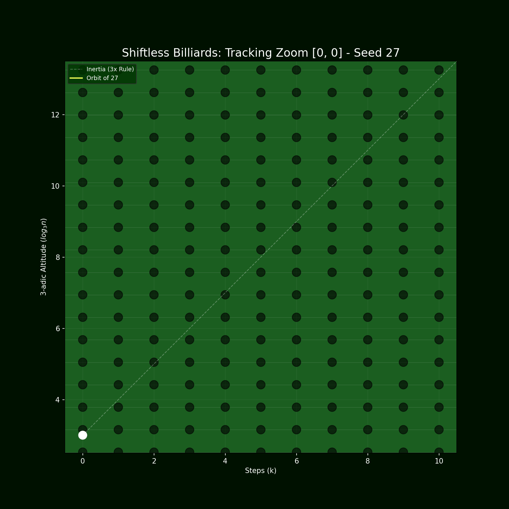

[](https://doi.org/10.5281/zenodo.19255189)
# Shiftless Collatz Billiards 🎱

**Author:** Hiroshi Harada  
**Date:** March 27, 2026  
**License:** Code under MIT, Generated Media under CC BY 4.0



## Overview

This repository provides Python visualization tools for exploring the **Shiftless Collatz Model**, a rewrite system that is mathematically equivalent to the classical Collatz iteration but preserves *all* binary information.

Unlike the standard $3n+1$ process, which repeatedly discards information through right-shifts (division by 2), the Shiftless Collatz Model evolves according to:

$$n_{k+1} = 3n_k + 2^{v_2(n_k)}$$

This formulation reveals a hidden geometric structure when plotted on a $\log_3$ lattice plane.  
The trajectory behaves like a **billiard ball** driven by:

- **Inertia** from the $3n$ multiplier  
- **Warp** from the LSB interference term $2^{v_2(n_k)}$  
- **Jackpot pockets** located at the powers of two, $2^M$

The result is a visually striking dynamical system where the orbit bends, oscillates, and ultimately converges into a $2^M$ “jackpot line.”

---

## Files Included

### `collatz_billiards_image.py`
Generates a **high-resolution (300 DPI)** static overview of the entire Shiftless Collatz trajectory.  
Ideal for research papers, posters, and static figures.

### `collatz_billiards_animation.py`
Exports a **cinematic tracking-zoom animation** (GIF and optionally MP4) featuring:

- Tile-by-tile camera movement  
- Pre- and post-transition pauses  
- Jackpot zoom-in moments  
- A final overview freeze frame  

Perfect for presentations, lectures, and visual demonstrations.

---

## Requirements

```bash
pip install numpy matplotlib tqdm
```

*Note: MP4 export requires `ffmpeg` installed on your system. GIF export works without `ffmpeg`.*

## Usage

Run the scripts directly from your terminal or Jupyter environment.
You can modify the `seed_to_hunt` variable at the bottom of each script to explore different trajectories.

```bash
# Generate the high-resolution still image
python collatz_billiards_image.py

# Export the animation (GIF and optionally MP4)
python collatz_billiards_animation.py
```

## Example Output (Seed = 27)

- 41-step journey
- Final jackpot at $2^{64}$
- Strong warp oscillations in the early phase
- Multiple near-misses in the mid-phase
- A dramatic final surge with local growth rate up to 3.2

The included GIF demonstrates this behavior.

## License

- Python Source Code: MIT License
- Generated Images / Animations: CC BY 4.0
- © 2026 Hiroshi Harada
```
